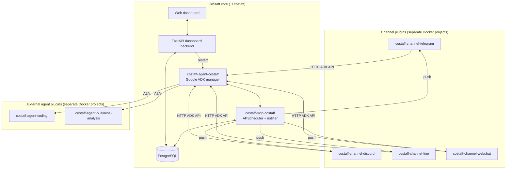

# CoStaff

[](https://www.python.org/)
[](https://www.docker.com/)
[](https://github.com/google/adk-python)
[](https://modelcontextprotocol.io/)
[](https://github.com/google/A2A)
[](https://www.gnu.org/licenses/agpl-3.0)

[繁體中文](./README_zhtw.md) | **English**

**CoStaff is a self-hosted AI assistant platform you run on your own machine.**
Talk to your assistant from Telegram, Discord, LINE, or a built-in web chat;
manage everything from a browser-based dashboard. No cloud account, no
data leaves your hardware.

> **Note:** CoStaff is shipped as **self-hosted software** (Path A in our
> [deployment strategy](docs/DEPLOYMENT_STRATEGY.md)). You install it on
> your laptop, on a home server, or on a VPS you own — we don't host
> anything for you.

---

## Who is this for

- **Operators** who want a personal AI assistant that lives on their own
  hardware and chats from the apps they already use.
- **Small teams** who want a single AI assistant their whole team can
  reach via a shared chat platform.
- **Builders** who want to add their own agents (coding, BA, anything
  speaking the A2A protocol) and tools (any MCP server) to the same chat.

If you want a SaaS that someone else hosts for you, CoStaff is not for
you yet — see the [deployment strategy](docs/DEPLOYMENT_STRATEGY.md) for
when that might change.

---

## What you can do once it's running

- **Chat from your existing apps.** Telegram, Discord, LINE, plus a
  built-in web chat for when you don't want to set up a bot.
- **Schedule reminders in plain language.** "Remind me to drink water at
  3 PM every day" — the assistant pushes a notification at the right time
  to whichever channel you connected.
- **Run recurring tasks.** "Search for the latest AI news every morning
  at 9 AM and send me a summary" — picks up the result, formats it,
  delivers to chat.
- **Hand work to specialist agents.** Coding tasks → the coding agent
  runs Python in a sandbox. BI questions → the business-analysis agent
  builds an HTML report with charts.
- **Manage everything from a browser.** Approve users, attach API keys,
  inspect chat history, watch live container logs.

---

## Prerequisites

| | Minimum | Notes |
|---|---|---|
| OS | macOS 12+ **or** Ubuntu 20.04 / 22.04 / 24.04 | Apple Silicon and Intel both work |
| RAM | 4 GB | 8 GB recommended for comfortable use |
| Disk | 5 GB free | Plus space for your data |
| Network | Outbound HTTPS | To download dependencies + reach AI provider |
| AI provider | A **Gemini API key** | Free tier from [Google AI Studio](https://aistudio.google.com/) is enough to get started; any LiteLLM-compatible provider also works |

> Docker and Python are installed automatically by the installer if not
> already present.

---

## Install

> **In a hurry?** [`docs/QUICKSTART.md`](./docs/QUICKSTART.md) gets you
> chatting in 5 minutes (the same install steps + a guided first chat).

One command, on macOS or Ubuntu:

```bash
curl -fsSL https://raw.githubusercontent.com/costaff-ai/costaff/main/install.sh | bash
```

The installer:
1. Detects your OS and installs missing dependencies (Homebrew /
   Xcode CLT on macOS; deadsnakes Python on Ubuntu; Docker; git; curl).
2. Clones the CoStaff repo to `~/.costaff/costaff`.
3. Creates an isolated Python virtualenv at `~/.costaff/.venv`.
4. Installs the `costaff` CLI into that venv and adds it to your `PATH`.
5. Launches the **setup wizard** — asks for your AI provider key, admin
   credentials, and which channels (if any) you want to set up.

If the installer prints **"manual steps"** at the end (e.g. "log out and
log back in for Docker group membership"), follow them, then run
`costaff onboard` yourself.

> **Headless / CI install?** `costaff bootstrap` is the non-interactive
> equivalent of `onboard` — it reads config from environment variables
> and auto-generates the security secrets, so you can provision a host
> without the wizard.

---

## First run

After the installer finishes:

```bash
# Start everything (Postgres → external agents → core → channels)
costaff start

# Open the operator dashboard
costaff dashboard
```

`costaff start` first runs a **preflight check** on your `.env` (API
key, database URI, secrets) and tells you exactly what to fix and how —
instead of letting a container crash-loop on a missing key.

The dashboard opens at **http://localhost:8501**. Log in with the admin
account from the setup wizard (or create one right in the browser on
first visit). Click **Chat** and start talking to the assistant — no
bot tokens needed.

If anything looks wrong at any point, run **`costaff doctor`** — it
checks containers, network, env vars, and the database, and ends with a
**Suggested fixes** list.

To add a Telegram / Discord / LINE bot later, go to **Dashboard →
Channels**, paste the token, and apply. The core platform doesn't need
to restart.

---

## Where things live

CoStaff puts everything under a single directory: `~/.costaff/`. You
own this directory; nothing else on your machine is touched.

```
~/.costaff/
├── .venv/                    # Isolated Python environment for the CLI
├── costaff/                  # Source + config
│   ├── .env                  # Your secrets (gitignored, never overwritten)
│   ├── config.json           # System config (gitignored, never overwritten)
│   ├── docker-compose.yaml   # Core stack definition
│   └── ...
├── costaff-agent/<name>/     # Each external agent plugin
│   ├── .env                  # That agent's secrets
│   ├── src/                  # Agent source (git clone)
│   └── compose-fragment.yaml
├── costaff-channel/<name>/   # Each channel plugin (telegram, discord, ...)
│   ├── .env                  # That channel's bot token
│   ├── src/                  # Channel source (git clone)
│   └── compose-fragment.yaml
└── workspace/                # Shared agent data (mounted into containers)
    └── shared/               # Files agents read/write for the user
```

### Secrets

| File | What's in it |
|---|---|
| `~/.costaff/costaff/.env` | Gemini API key, admin password hash, MCP secret, identity hash salt, database URI |
| `~/.costaff/costaff-channel/telegram/.env` | `TELEGRAM_BOT_TOKEN` |
| `~/.costaff/costaff-channel/discord/.env` | `DISCORD_BOT_TOKEN` |
| `~/.costaff/costaff-channel/line/.env` | `LINE_CHANNEL_ACCESS_TOKEN`, `LINE_CHANNEL_SECRET` |
| `~/.costaff/costaff-agent/<name>/.env` | Per-agent credentials |

These files are **never** modified by `costaff update` or any git
operation. Back them up like you'd back up SSH keys.

### Data

| Path | Contains |
|---|---|
| Postgres volume `costaff_postgres_data` | Identity table, sessions, chat history, reminders, recurring tasks |
| `~/.costaff/workspace/shared/` | Files agents produced for you (CSVs, PDFs, reports) |
| `~/.costaff/workspace/agent-<name>/` | Per-agent scratch space |

To back up everything in one shot — `.env`, `config.json`, the database,
and the workspace — run **`costaff backup`** (writes a single `.tar.gz`);
**`costaff restore <file>`** brings it all back, which is also the easiest
way to move an install to another machine.

---

## Day-to-day commands

| Command | What it does |
|---|---|
| `costaff start` | Start every CoStaff service, in the right order |
| `costaff start --no-build` | Same, but skip rebuilding Docker images |
| `costaff stop` | Stop everything cleanly |
| `costaff restart` | Stop + start |
| `costaff status` | Show which containers are running |
| `costaff logs <service>` | Tail logs for one service (or all if omitted) |
| `costaff dashboard` | Launch the web dashboard |
| `costaff chat` | Talk to the assistant in your terminal |
| `costaff invoke <message>` | Send one message and exit (handy for scripts) |
| `costaff doctor` | Diagnose common issues; writes a timestamped report |
| `costaff update` | Pull the latest CoStaff release from GitHub |
| `costaff update --tag <ref>` | Pin the core to a specific release tag (or roll back) |
| `costaff update --all --tag <ref>` | Also re-pin + rebuild every agent and channel to that tag |
| `costaff core-rebuild` | Rebuild + recreate just the core stack (after a core update) |
| `costaff backup` | Snapshot the whole install (.env, config, DB, workspace) to one archive |
| `costaff restore <file>` | Restore a full install from a backup archive |

### Managing agents

```bash
costaff agent list                                  # Show registered agents (with pinned Ref)
costaff agent add <name> --github <repo URL>        # Clone + deploy a GitHub agent
costaff agent add <name> --github <url> --tag <ref> # Clone pinned to a release tag
costaff agent add <name> --local <path>             # Deploy a local agent project
costaff agent add <name> --url <a2a URL>            # Register a remote A2A endpoint
costaff agent tags <name>                           # List release tags on the agent's origin
costaff agent restart <name>                        # Restart an agent's containers
costaff agent rebuild <name>                        # Rebuild + restart (after code changes)
costaff agent rebuild <name> --tag <ref>            # Rebuild and re-pin to a new tag
costaff agent enable <name> / disable <name>        # Toggle an agent on or off
costaff agent remove <name>                         # Remove an agent
costaff agent model                                 # Inspect/set the per-agent model
```

### Managing channels

```bash
costaff channel list             # Show registered channels with health + pinned Ref
costaff channel add <name>       # Add a channel (interactive, official channels auto-resolved)
costaff channel add <name> --tag <ref>   # Add a channel pinned to a release tag
costaff channel tags <name>      # List release tags on the channel's origin
costaff channel rebuild <name>   # Rebuild + restart a channel (--tag <ref> to re-pin)
costaff channel remove <name>    # Remove a channel
```

### Managing business platforms

Beyond agents and channels, CoStaff can stand up the optional **business
platform suite** (ERP, CRM, SCM, HRM, accounting, …) — each a separate
Docker project that shares one PostgreSQL and the Account Manager (OIDC
single sign-on):

```bash
costaff platform list            # Show platforms with health, in dependency order
costaff platform add <name>      # Official names auto-resolve to their repo; wires shared DB + OIDC
costaff platform rebuild <name>  # Rebuild + restart a platform
costaff platform start | stop    # Start/stop the whole suite in dependency order (db first)
costaff platform provision       # (Re)provision the shared DB roles/databases (idempotent)
costaff platform remove <name>   # Remove a platform (add --purge to drop its volume too)
```

### Other

```bash
costaff config validate          # Validate config.json against the schema
costaff database info            # Show the database connection + a table summary
costaff database migrate         # Apply pending schema migrations (alembic upgrade head)
costaff database history         # Show migration history + the current revision
costaff database backup          # Dump the Postgres database to a file
costaff database restore <file>  # Restore the database from a dump
costaff database clean           # Drop + recreate the schema (destructive)
costaff license                  # Manage your CoStaff license
```

---

## Update

```bash
costaff update                       # Fast-forward the core to the latest release
costaff update --tag v0.1.0-alpha-2  # Pin the core to a specific release (or roll back)
```

`costaff update` pulls the latest core release and reinstalls the CLI.
Your `.env`, `config.json`, and database are untouched.

### Pinning versions (reproducible deploys)

Every plugin can be pinned to a release tag, so a host runs an exact,
reproducible set of versions instead of tracking each repo's `main`:

```bash
costaff agent tags business-analysis                # Discover which release tags exist
costaff agent add business-analysis \
  --github <url> --tag v0.1.0-alpha-2               # Clone pinned to a tag
costaff agent rebuild business-analysis --tag v0.1.0-alpha-2   # Re-pin + rebuild
costaff channel tags telegram                       # Same flow for channels
costaff update --tag v0.1.0-alpha-2                 # Pin the core itself
costaff update --all --tag v0.1.0-alpha-2           # Align the core + every plugin in one shot
```

`agent list` / `channel list` show each plugin's current pinned **Ref**.
The pin is persisted in `config.json` and honoured on every rebuild — see
the latest [Releases](https://github.com/costaff-ai/costaff/releases) for
available tags.

---

## Remove

```bash
# Stop everything
costaff stop

# Remove containers, images, and the docker network
docker compose -f ~/.costaff/costaff/docker-compose.yaml down --rmi local --volumes

# (Optional) wipe the Postgres data volume
docker volume rm costaff_postgres_data

# (Optional) delete the install directory and your data
rm -rf ~/.costaff
```

You're back to the state you were in before installing.

---

## Troubleshooting

**First reflex: `costaff doctor`.** It diagnoses containers, network,
env vars, and the database in one shot, prints a **Suggested fixes**
list, and saves a timestamped report you can attach to a GitHub issue.

### `costaff: command not found` after install

Reload your shell so the new PATH entry takes effect:

```bash
source ~/.zshrc      # macOS default
source ~/.bashrc     # Ubuntu default
```

### "Cannot connect to Docker daemon"

- **macOS**: Open Docker Desktop from Launchpad and wait for the whale
  icon in the menu bar.
- **Ubuntu**: Log out and back in (the installer added you to the
  `docker` group), or `newgrp docker` in a new terminal.

### "Port already in use" on start

The dashboard uses `8501`, the core agent `18080`, Postgres `5432`,
the webchat `18091`. Stop whatever else is bound to those ports, or
edit `~/.costaff/costaff/docker-compose.yaml`.

### Bot doesn't reply

```bash
costaff status                                  # Are all containers up?
costaff logs costaff-channel-telegram           # Recent errors?
costaff doctor                                  # Full diagnostic report
```

### Reset everything to a clean state

```bash
costaff stop
docker compose -f ~/.costaff/costaff/docker-compose.yaml down --volumes
costaff start
```

You'll lose chat history and the identity table. Bot tokens and API
keys (in `.env` files) survive.

---

## Architecture

CoStaff is a **plugin platform**. The core (agent + MCP + dashboard)
runs as one Docker stack. Each channel and each external agent runs as
its own Docker project and connects via the shared `costaff_default`
network.



All chatbot-style channels share a runtime SDK
([costaff-channel-chatbot](https://github.com/costaff-ai/costaff-channel-chatbot))
so each platform repo is a thin adapter (~150 lines) on top of the same
ADK pipeline.

### First-party plugins

| Repo | Purpose |
|---|---|
| [costaff-channel-telegram](https://github.com/costaff-ai/costaff-channel-telegram) | Telegram bot |
| [costaff-channel-discord](https://github.com/costaff-ai/costaff-channel-discord) | Discord bot |
| [costaff-channel-line](https://github.com/costaff-ai/costaff-channel-line) | LINE bot |
| [costaff-channel-slack](https://github.com/costaff-ai/costaff-channel-slack) | Slack bot (Socket Mode) |
| [costaff-channel-webchat](https://github.com/costaff-ai/costaff-channel-webchat) | Browser-based web chat |
| [costaff-agent-coding](https://github.com/costaff-ai/costaff-agent-coding) | Sandboxed Python code execution |
| [costaff-agent-business-analysis](https://github.com/costaff-ai/costaff-agent-business-analysis) | BI reporting & visualization |

---

## Web dashboard reference

| Module | What it shows |
|--------|---------------|
| **Dashboard** | Live system stats and service health |
| **Chat** | Talk to the assistant directly |
| **Agents** | Status of internal/external agents; per-agent MCP / API / Skill assignment |
| **MCPs** | Add/remove external MCP servers at runtime |
| **APIs** | Register external REST APIs and assign them per agent / per user |
| **Skills** | Register reusable prompt templates and assign them per agent / per user |
| **Reminders** | Cron reminders the assistant has scheduled |
| **Tasks** | Recurring task history (web search, DB queries, report generation) |
| **Users** | Identity Map; per-user profile (name, role, company, preferences) |
| **Sessions** | Browse chat sessions; full function call / response traces |
| **Channels** | Manage Telegram / Discord / LINE bot tokens |
| **Config** | Theme, model provider, approval-gate toggle |
| **Logs** | Stream container logs from any service |

---

## Bot interaction

After you've added a bot token (in **Dashboard → Channels**), open the
bot in your chat app and send any message. The first message creates a
**pending** identity — log into the dashboard, go to **Users**, and
approve yourself. After that, the assistant responds normally.

| Slash command | Behavior |
|---|---|
| `/reset` | Start a new conversation (clears the current session) |

Other slash command names appear in the bot menu (`/start`, `/help`,
`/profile`, `/list`) but they're handled as natural language — you can
type the same thing in plain text and get the same result.

**Natural-language examples**:

- "Remind me to drink water at 3 PM every day."
- "Search for the latest AI news every morning at 9 AM and send me a summary."
- "Analyse this CSV and generate an HTML report with charts." *(attach a CSV)*
- "Save my name as Simon and my role as software engineer."

---

## Tech stack

| Layer | Technology |
|---|---|
| Agent framework | [Google ADK](https://github.com/google/adk-python) |
| Agent-to-agent | A2A protocol (`RemoteA2aAgent`) |
| Tool protocol | [Model Context Protocol (MCP)](https://modelcontextprotocol.io/) |
| AI models | Google Gemini, any LiteLLM-compatible provider |
| Channel SDK | [costaff-channel-chatbot](https://github.com/costaff-ai/costaff-channel-chatbot) |
| Web backend | [FastAPI](https://fastapi.tiangolo.com/) + [uvicorn](https://www.uvicorn.org/) |
| Database | [SQLAlchemy](https://www.sqlalchemy.org/) — PostgreSQL (required) |
| Scheduler | [APScheduler](https://apscheduler.readthedocs.io/) |
| Deployment | Docker + Docker Compose |
| CLI | [Typer](https://typer.tiangolo.com/) + [Rich](https://rich.readthedocs.io/) |

---

## License

Dual-licensed under **AGPL v3** + **commercial license**.

- **Personal use** (running CoStaff for yourself on your own hardware,
  within the OSS limits — 3 agents / 1 user / 10 skills):
  **free under AGPL v3**.
- **Hosting CoStaff as a service for external / paying users** — e.g.
  reselling it, running it as a SaaS, or letting customers interact
  with a CoStaff instance you operate — triggers **AGPL §13**: you must
  release your modifications (including private skills, prompts, and
  workflow code) under AGPL v3, OR acquire a **commercial license**
  that waives that obligation.
- **Redistributing modified CoStaff** (forking and shipping your fork
  to others): standard AGPL v3 obligations apply.

See [`LICENSE`](./LICENSE) for the full text.

## Commercial License

The OSS tier is **personal-use only** — 3 agents / 1 user / 10 skills,
intended for evaluation, demos, and your own AI assistant. For 2+ users
or higher quotas, paid tiers unlock:

- **Higher limits** — more agents, users, skills (Starter / Pro /
  Enterprise tiers).
- **Enterprise WebChat** — multi-tenant Org × Team × CoStaff routing,
  audit logs, SSO, file delivery, sub-agent progress panels.
- **Premium Agents** — production-grade specialists for specific
  verticals.
- **Field deployment engagement** — onboarding, customization, and
  integration support.
- **AGPL §13 waiver** — host CoStaff for external users without the
  source-disclosure obligation.

Pricing tiers, comparison, and how to start: **https://costaffs.app**

---

## Support

- **Documentation**: see the [`docs/`](./docs) folder
- **Issues**: [github.com/costaff-ai/costaff/issues](https://github.com/costaff-ai/costaff/issues)
- **Discussions**: [github.com/costaff-ai/costaff/discussions](https://github.com/costaff-ai/costaff/discussions)
- **Security**: see [`SECURITY.md`](./SECURITY.md) for private disclosure
