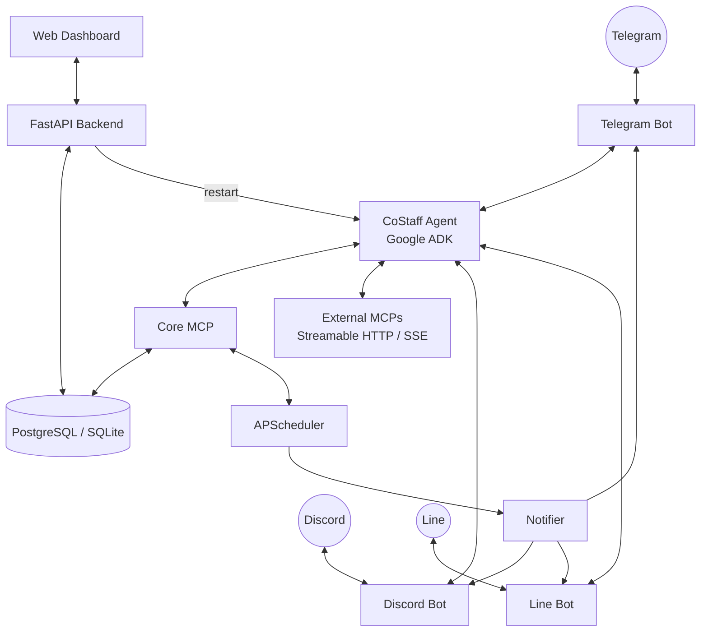

# CoStaff

[](https://www.python.org/)
[](https://www.docker.com/)
[](https://github.com/google/adk-python)
[](https://modelcontextprotocol.io/)
[](https://github.com/google/A2A)
[](https://www.gnu.org/licenses/agpl-3.0)

[繁體中文](./README_zhtw.md) | **English**

**CoStaff** is a self-hosted, privacy-first AI agent platform built on **Google ADK (Agent Development Kit)** and **Model Context Protocol (MCP)**. It connects your preferred chat platforms — **Telegram, Discord, and Line** — while exposing a full-featured web dashboard for operators to manage agents, tools, users, and sessions.

External agents (such as [`costaff-coding-agent`](https://github.com/CoStaffAI/costaff-coding-agent) and [`costaff-viz-report-agent`](https://github.com/CoStaffAI/costaff-viz-report-agent)) integrate via the **A2A protocol**, extending the platform's capabilities without modifying the core.

---

## Table of Contents

- [Features](#features)
- [Architecture](#architecture)
- [Web Dashboard](#web-dashboard)
- [External Agents](#external-agents)
- [Tech Stack](#tech-stack)
- [Getting Started](#getting-started)
- [CLI Reference](#cli-reference)
- [Bot Commands](#bot-commands)
- [License](#license)

---

## Features

- **Multi-Agent Orchestration** — The primary CoStaff Agent delegates tasks to external agents via A2A protocol; add any `costaff.agent.json`-compatible agent with a single CLI command
- **Per-Agent Tool Assignment** — Assign which MCPs, APIs, and Skills each agent can access; changes apply with a targeted restart, no full redeploy needed
- **Dynamic MCP Layer** — Core MCPs are always present; add external MCPs (streamable HTTP or SSE) from the dashboard at runtime
- **API & Skill Registry** — Register external REST APIs and reusable prompt templates in the database, assigned per-agent and per-user
- **Multi-Channel Support** — Telegram, Discord, and Line bots out of the box
- **Multi-Model Support** — Google Gemini natively, or any LiteLLM-compatible provider
- **Secure Identity Hashing** — Platform IDs are mapped to 16-character SHA-256 hashes; real IDs never stored
- **Identity Approval Workflow** — New users held pending until operator approves from the dashboard
- **User Profile Memory** — Agent remembers name, role, company, contact info, and preferences across sessions
- **Proactive Reminders** — Schedule cron-based notifications delivered to any connected chat platform
- **Kanban Task Automation** — Recurring agent tasks (web search, DB queries, report generation) that push results back to users
- **Web Dashboard** — Dark/light mode operator console for full lifecycle management

---

## Architecture



---

## Web Dashboard

The dashboard (`cst dashboard`) is a browser-based operator console with dark/light mode:

| Module | Description |
|--------|-------------|
| **Dashboard** | Live system stats (CPU, memory, disk) and service health overview |
| **Chat** | Talk to the CoStaff Agent directly from the browser with full conversation history |
| **Agents** | View internal/external agent status; configure per-agent MCP assignments with Apply & Restart |
| **MCPs** | Manage MCP extensions — add/remove external MCPs at runtime |
| **APIs** | Register external REST API configs and assign them per-agent or per-user |
| **Skills** | Register reusable prompt templates and assign them per-agent or per-user |
| **Reminders** | View and manage scheduled cron reminders |
| **Tasks** | Monitor Kanban-style automation task results |
| **Users** | Identity Map with User Profile detail panel |
| **Sessions** | Browse chat sessions; Event Logs show full function call / response traces |
| **Channels** | Configure Telegram / Discord / Line bot tokens |
| **Config** | Theme, model provider, approval gate settings |
| **Logs** | Stream container logs from any service in real time |

---

## External Agents

CoStaff supports deploying and managing external agents that communicate via the **A2A protocol**.

Any project containing a `costaff.agent.json` manifest can be registered and deployed:

```bash
# Deploy a local agent project
cst agent deploy --local /path/to/my-agent

# Add a remote URL agent
cst agent add my-agent --url http://my-agent.example.com

# List all agents
cst agent list
```

**First-party agents:**

| Agent | Repository | Role |
|-------|------------|------|
| Coding Agent | [costaff-coding-agent](https://github.com/CoStaffAI/costaff-coding-agent) | Sandboxed Python code execution |
| Viz Report Agent | [costaff-viz-report-agent](https://github.com/CoStaffAI/costaff-viz-report-agent) | Chart generation & HTML/PDF reports |

---

## Tech Stack

| Layer | Technology |
|-------|------------|
| Agent Framework | [Google ADK](https://github.com/google/adk-python) |
| Agent-to-Agent | A2A Protocol (`RemoteA2aAgent`) |
| Tool Protocol | [Model Context Protocol (MCP)](https://modelcontextprotocol.io/) |
| AI Models | Google Gemini, LiteLLM-compatible providers |
| Telegram Bot | [Aiogram 3.x](https://docs.aiogram.dev/) |
| Discord Bot | [discord.py](https://discordpy.readthedocs.io/) |
| Line Bot | [line-bot-sdk](https://github.com/line/line-bot-sdk-python) |
| Web Backend | [FastAPI](https://fastapi.tiangolo.com/) + [uvicorn](https://www.uvicorn.org/) |
| Database | [SQLAlchemy](https://www.sqlalchemy.org/) — PostgreSQL or SQLite |
| Scheduler | [APScheduler](https://apscheduler.readthedocs.io/) |
| Deployment | Docker + Docker Compose |
| CLI | [Typer](https://typer.tiangolo.com/) + [Rich](https://rich.readthedocs.io/) |

---

## Getting Started

### Prerequisites

- Python 3.10+
- Docker and Docker Compose
- At least one of:
  - **Gemini API Key** from [Google AI Studio](https://aistudio.google.com/)
  - **LiteLLM-compatible** provider API key

### 1. Install the CLI

```bash
pip install -e .
```

### 2. Run the Setup Wizard

```bash
cst onboard
```

The wizard configures:
- AI model provider (Gemini or LiteLLM)
- Database type (SQLite or PostgreSQL)
- Bot tokens (Telegram, Discord, Line — all optional)
- Admin credentials for the web dashboard
- Identity hashing salt

All configuration is saved to `.costaff/` in the current directory.

### 3. Start the Platform

```bash
cst start
```

### 4. Open the Dashboard

```bash
cst dashboard
```

Opens the web UI at `http://localhost:8501`.

---

## CLI Reference

| Command | Description |
|---------|-------------|
| `cst onboard` | Interactive setup wizard |
| `cst start` | Build and start all services |
| `cst start --no-build` | Start without rebuilding images |
| `costaff stop` | Stop all services |
| `costaff restart` | Restart all services |
| `costaff ps` | Show status of running services |
| `cst dashboard` | Open the web dashboard |
| `costaff chat` | CLI-based chat with the agent |
| `cst agent deploy --local <path>` | Deploy a local agent project |
| `cst agent add <name> --url <url>` | Register a remote URL agent |
| `cst agent list` | List all registered agents |
| `cst agent remove <name>` | Remove a registered agent |
| `costaff config show` | Display current configuration |
| `costaff database backup` | Backup the database |
| `costaff database restore` | Restore from a backup |
| `costaff version` | Show CLI version |

---

## Bot Commands

Available on Telegram, Discord, and Line:

| Command | Description |
|---------|-------------|
| `/start` | Initialise session and check identity |
| `/profile` | View your stored profile |
| `/list` | List active reminders and tasks |
| `/reset` | Clear the current conversation context |
| `/help` | Show available commands |

**Natural language examples:**

- "Remind me to drink water at 3 PM every day."
- "Search for the latest AI news every morning at 9 AM and send me a summary."
- "Analyse this CSV and generate an HTML report with charts."
- "Save my name as Simon and my role as Software Engineer."

---

## License

This project is dual-licensed under **AGPL v3 + Commercial License**. See `LICENSE` for details.

For commercial licensing inquiries, contact: simonliuyuwei@gmail.com
