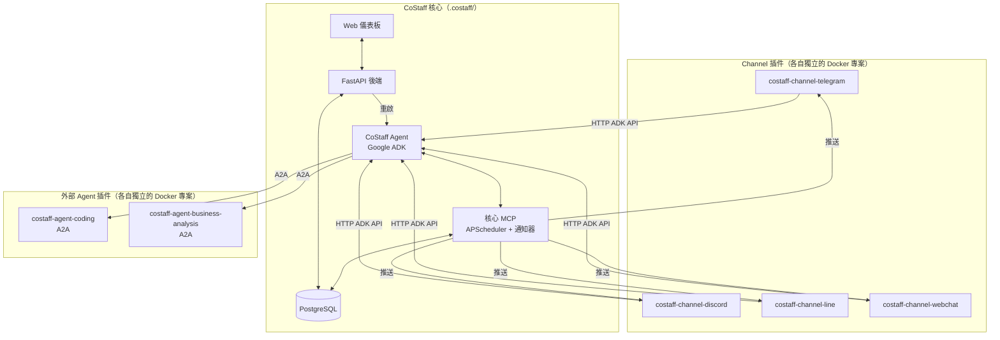

# CoStaff

[](https://www.python.org/)
[](https://www.docker.com/)
[](https://github.com/google/adk-python)
[](https://modelcontextprotocol.io/)
[](https://github.com/google/A2A)
[](https://www.gnu.org/licenses/agpl-3.0)

**繁體中文** | [English](./README.md)

**CoStaff** 是一個自架、隱私優先的 AI Agent 平台，基於 **Google ADK（Agent Development Kit）** 和 **Model Context Protocol（MCP）** 構建。它連接你偏好的聊天平台——**Telegram、Discord 和 Line**——並提供功能完整的 Web 儀表板，讓操作者管理 Agent、工具、使用者與對話。

外部 Agent（如 [`costaff-agent-coding`](https://github.com/costaff-ai/costaff-agent-coding) 和 [`costaff-agent-business-analysis`](https://github.com/costaff-ai/costaff-agent-business-analysis)）透過 **A2A 協議**整合，在不修改核心的情況下擴展平台能力。

---

## 目錄

- [功能特色](#功能特色)
- [系統架構](#系統架構)
- [Web 儀表板](#web-儀表板)
- [外部 Agent](#外部-agent)
- [技術棧](#技術棧)
- [快速開始](#快速開始)
- [CLI 指令參考](#cli-指令參考)
- [Bot 指令](#bot-指令)
- [授權](#授權)

---

## 功能特色

- **多 Agent 編排** — 主 CoStaff Agent 透過 A2A 協議將任務委派給外部 Agent；任何含有 `costaff.agent.json` 宣告的 Agent 都可一鍵接入
- **逐 Agent 工具指派** — 從儀表板指定每個 Agent 可存取的 MCP、API 和 Skill，套用後針對性重啟，無需全量重新部署
- **動態 MCP 層** — 核心 MCP 始終存在；可在儀表板即時新增外部 MCP（Streamable HTTP 或 SSE）
- **API 與 Skill 登記冊** — 在資料庫中登記外部 REST API 和可重用的提示詞範本，按 Agent 和使用者分別指派
- **多平台支援** — 開箱即用的 Telegram、Discord 和 Line Bot
- **多模型支援** — 原生支援 Google Gemini，或任何 LiteLLM 相容的模型提供者
- **安全身份雜湊** — 平台 ID 對應至 16 字元 SHA-256 雜湊，真實 ID 永不儲存
- **身份審核流程** — 新使用者進入待審狀態，操作者從儀表板核准後才能使用
- **使用者檔案記憶** — Agent 跨對話記住姓名、職稱、公司、聯絡資訊和偏好設定
- **主動提醒** — 排程 Cron 通知，推送至任何已連接的聊天平台
- **看板任務自動化** — 排程執行的 Agent 任務（網路搜尋、資料庫查詢、報告生成），結果主動推送給使用者
- **Web 儀表板** — 支援深色/淺色模式的操作者控制台，全生命週期管理

---

## 系統架構

CoStaff 採用**插件式架構**。核心平台（Agent + MCP + 儀表板）作為獨立 Docker Stack 運行。Channel 和外部 Agent 各自擁有獨立的 Docker 專案，透過共用的 `costaff_default` 網路連接到核心。



所有插件透過 **`costaff_default` Docker 網路**連接——服務之間不需要 port mapping 或 tunnel。

---

## Web 儀表板

儀表板（`costaff dashboard`）是支援深色/淺色模式的瀏覽器操作控制台：

| 模組 | 說明 |
|------|------|
| **Dashboard** | 即時系統狀態（CPU、記憶體、磁碟）與服務健康概覽 |
| **Chat** | 直接在瀏覽器中與 CoStaff Agent 對話，含完整對話歷史 |
| **Agents** | 查看內外部 Agent 狀態；設定逐 Agent 的 MCP 指派，Apply & Restart 即生效 |
| **MCPs** | 管理 MCP 擴充 — 即時新增/移除外部 MCP |
| **APIs** | 登記外部 REST API 設定，按 Agent 和使用者指派 |
| **Skills** | 登記可重用提示詞範本，按 Agent 和使用者指派 |
| **Reminders** | 查看和管理排程 Cron 提醒 |
| **Tasks** | 監控看板式自動化任務結果 |
| **Users** | 身份對應表與使用者檔案詳情面板 |
| **Sessions** | 瀏覽對話 Session；事件日誌顯示完整的 Function Call / Response 追蹤 |
| **Channels** | 設定 Telegram / Discord / Line Bot Token |
| **Config** | 主題、模型提供者、審核閘門設定 |
| **Logs** | 即時串流任意服務的容器日誌 |

---

## 外部 Agent

CoStaff 支援部署和管理透過 **A2A 協議**溝通的外部 Agent。

任何包含 `costaff.agent.json` 宣告的專案都可以被登記和部署：

```bash
# 部署本地 Agent 專案
costaff agent deploy --local /path/to/my-agent

# 新增遠端 URL Agent
costaff agent add my-agent --url http://my-agent.example.com

# 列出所有 Agent
costaff agent list
```

**官方第一方 Agent：**

| Agent | Repository | 職責 |
|-------|------------|------|
| Coding Agent | [costaff-agent-coding](https://github.com/costaff-ai/costaff-agent-coding) | 沙盒 Python 程式碼執行 |
| Business Analysis Agent | [costaff-agent-business-analysis](https://github.com/costaff-ai/costaff-agent-business-analysis) | BI 報告生成與數據視覺化 |

---

## 插件架構說明

CoStaff 設計為**可插拔平台**。Channel 和 Agent 都是獨立的 Docker 專案，在執行期間掛接到核心——無需修改核心程式碼。

### 插件如何連接

每個插件（Channel 或 Agent）加入共用 Docker 網路：

```yaml
# 插件的 docker-compose.yaml 中
networks:
  default:
    external: true
    name: costaff_default
```

這讓插件可以直接透過容器主機名稱存取 `costaff-agent-costaff`（ADK API，port 8080）和 `costaff-mcp-costaff`（MCP，port 8000）。

### Channel 插件

Channel 是獨立的 Bot 或 HTTP 伺服器，負責：
1. 接收來自使用者的訊息（Telegram、Discord、LINE、HTTP）
2. 透過 ADK API 的 `POST /run` 轉發給 CoStaff Agent
3. 接收來自 MCP 通知器的推送訊息

內建 Channel 存放於 `.costaff/dynamic-channels/`，執行 `costaff start` 時自動啟動。

### Agent 插件

外部 Agent 公開相容 **A2A 協議**的端點，並登記 `costaff.agent.json` manifest。CoStaff Agent 會自動發現並委派任務給它們。

```bash
# 登記本地 Agent 專案
costaff agent deploy --local /path/to/my-agent

# 登記遠端 Agent
costaff agent add my-agent --url http://my-agent.internal
```

---

## 技術棧

| 層級 | 技術 |
|------|------|
| Agent 框架 | [Google ADK](https://github.com/google/adk-python) |
| Agent 間通訊 | A2A Protocol（`RemoteA2aAgent`） |
| 工具協議 | [Model Context Protocol (MCP)](https://modelcontextprotocol.io/) |
| AI 模型 | Google Gemini、LiteLLM 相容提供者 |
| Telegram Bot | [Aiogram 3.x](https://docs.aiogram.dev/) |
| Discord Bot | [discord.py](https://discordpy.readthedocs.io/) |
| Line Bot | [line-bot-sdk](https://github.com/line/line-bot-sdk-python) |
| Web 後端 | [FastAPI](https://fastapi.tiangolo.com/) + [uvicorn](https://www.uvicorn.org/) |
| 資料庫 | [SQLAlchemy](https://www.sqlalchemy.org/) — PostgreSQL（必要） |
| 排程器 | [APScheduler](https://apscheduler.readthedocs.io/) |
| 部署 | Docker + Docker Compose |
| CLI | [Typer](https://typer.tiangolo.com/) + [Rich](https://rich.readthedocs.io/) |

---

## 快速開始

### 前置需求

- Python 3.10+
- Docker 與 Docker Compose
- 來自 [Google AI Studio](https://aistudio.google.com/) 的 **Gemini API Key**（或任何 LiteLLM 相容的模型提供者）

### 最快啟動方式（不需要 Bot Token）

內建的 **Webchat** Channel 可以讓你立即開始使用，無需設定任何 Telegram、Discord 或 Line Token。

```bash
# 1. 安裝 CLI
pip install -e .

# 2. 執行設定精靈（只需填入 Gemini API Key）
costaff onboard

# 3. 啟動平台
costaff start

# 4. 開啟儀表板
costaff dashboard
```

開啟 **http://localhost:8501**，進入 **Chat**，即可立即開始與 Agent 對話。

之後想新增 Bot Channel，只需前往 **儀表板 → Channels** 輸入 Token——無需重啟核心平台。

### 完整設定

設定精靈（`costaff onboard`）會引導你完成：
- AI 模型提供者選擇（Gemini 或 LiteLLM）
- PostgreSQL 連線設定
- Bot Token 設定（Telegram、Discord、Line——皆為選填）
- 儀表板管理員帳號設定
- 身份雜湊鹽值設定

所有設定儲存至當前目錄的 `.costaff/`。

---

## CLI 指令參考

| 指令 | 說明 |
|------|------|
| `costaff onboard` | 互動式設定精靈 |
| `costaff start` | 建置並啟動所有服務 |
| `costaff start --no-build` | 不重建映像直接啟動 |
| `costaff stop` | 停止所有服務 |
| `costaff restart` | 重啟所有服務 |
| `costaff ps` | 顯示運行中服務的狀態 |
| `costaff dashboard` | 開啟 Web 儀表板 |
| `costaff chat` | CLI 模式與 Agent 對話 |
| `costaff agent deploy --local <path>` | 部署本地 Agent 專案 |
| `costaff agent add <name> --url <url>` | 登記遠端 URL Agent |
| `costaff agent list` | 列出所有已登記的 Agent |
| `costaff agent remove <name>` | 移除已登記的 Agent |
| `costaff config show` | 顯示當前設定 |
| `costaff database backup` | 備份資料庫 |
| `costaff database restore` | 從備份還原 |
| `costaff version` | 顯示 CLI 版本 |

---

## Bot 指令

適用於 Telegram、Discord 和 Line：

| 指令 | 說明 |
|------|------|
| `/start` | 初始化 Session 並驗證身份 |
| `/profile` | 查看已儲存的個人檔案 |
| `/list` | 列出有效的提醒和任務 |
| `/reset` | 清除當前對話上下文 |
| `/help` | 顯示可用指令 |

**自然語言範例：**

- 「每天下午三點提醒我喝水。」
- 「每天早上九點搜尋最新 AI 新聞並發摘要給我。」
- 「分析這份 CSV 並生成一份含圖表的 HTML 報告。」
- 「記住我叫 Simon，職稱是軟體工程師。」

---

## 授權

本專案採用 **AGPL v3 + 商業授權**雙授權模式。詳見 `LICENSE`。

商業授權洽詢請至：https://costaffs.app

## 支援管道

- 文件：[`docs/`](./docs) 目錄
- Issues：https://github.com/costaff-ai/costaff/issues
- Discussions：https://github.com/costaff-ai/costaff/discussions
- 安全性回報：見 [`SECURITY.md`](./SECURITY.md)
